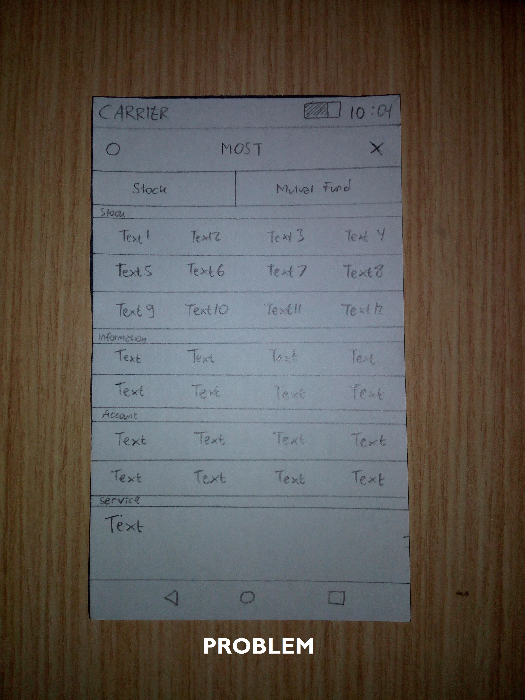
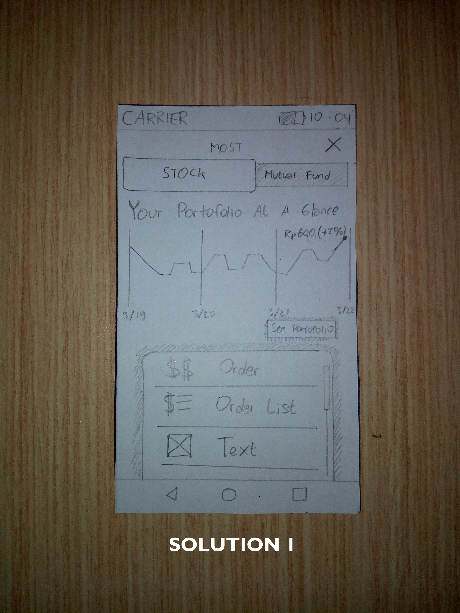
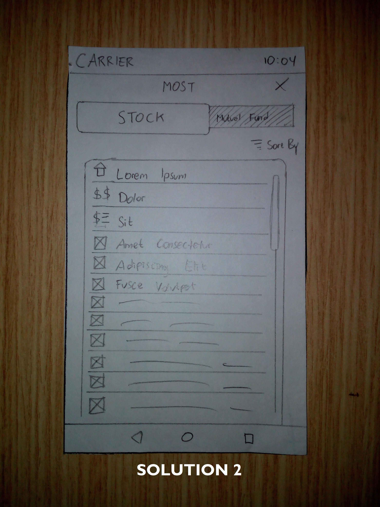
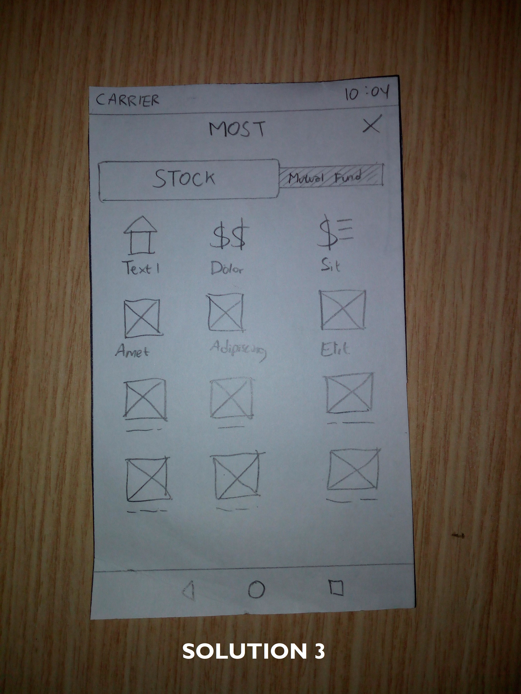
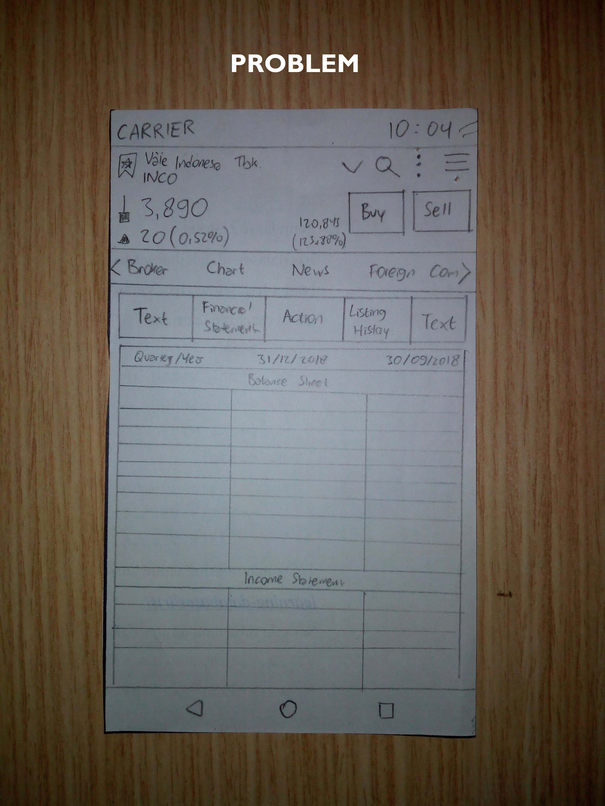
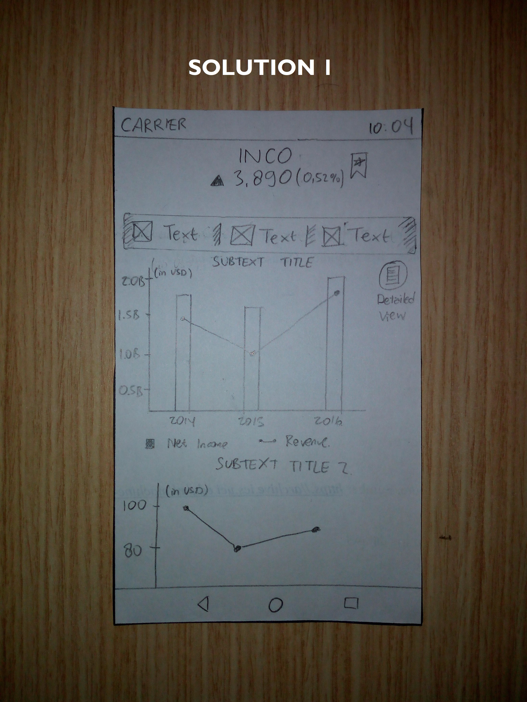
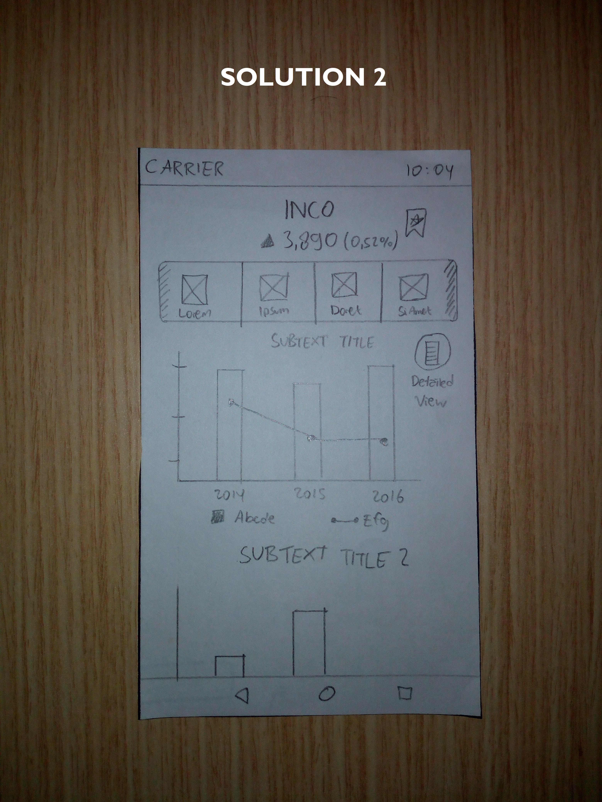
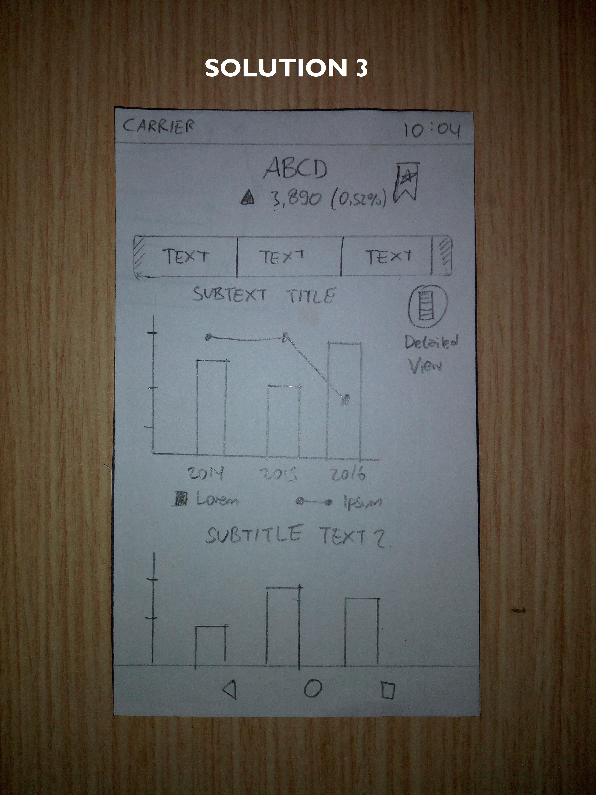
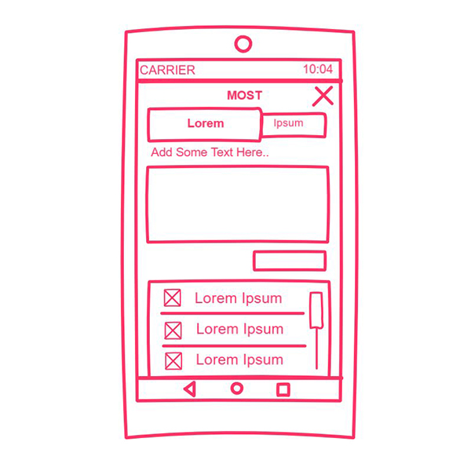
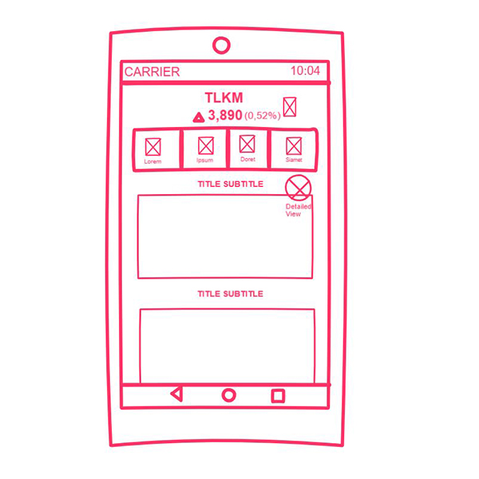

#Outline

- [Sketching and Prototyping](#sketching-and-prototyping)
  - [Part A: Sketches](#part-a-sketches)
    - [1. Scan/Photo of Sketches](#1-scanphoto-of-sketches)
      - [1.1 Too many text, lack of icon](#11-too-many-text-lack-of-icon)
      - [1.2 Texts to dense, need space](#12-texts-to-dense-need-space)
    - [2. Version Differences](#2-version-differences)
      - [2.1 Too many text, lack of icon](#21-too-many-text-lack-of-icon)
      - [Version 1](#version-1)
      - [Version 2](#version-2)
      - [Version 3](#version-3)
      - [2.2 Texts to dense, need space](#22-texts-to-dense-need-space)
      - [Version 1](#version-1-1)
      - [Version 2](#version-2-1)
      - [Version 3](#version-3-1)
    - [3. Selected Sketch](#3-selected-sketch)
      - [3.1 Too many text, lack of icon](#31-too-many-text-lack-of-icon)
      - [3.2 Texts to dense, need space](#32-texts-to-dense-need-space)
    - [4. Design Rationale](#4-design-rationale)
  - [Part B: Assumptions](#part-b-assumptions)
    - [1. Hardware](#1-hardware)
    - [2. Users](#2-users)
  - [Part C: Prototypes](#part-c-prototypes)

[Prior assignment](https://github.com/hci-a-if-its-2019/assignment-1-aufawibowo)
# Sketching and Prototyping
Using the information in the results of Assignment 1 for what is good and bad about the UI for designed tasks, we are going to make **Sketches** and **Prototypes**. These sketches and prototypes will lead to better design in Assignment 3. The prototypes will be then tested through a usability evaluation followed by design revision in Assignment 4.

## Part A: Sketches
Sketch at least **3 (three)** different UIs for the functions you are targeting. These three interfaces should be _dramatically different_ in terms of design directions. For example, they can be with different organizations of what functions on each screen or using a different layout of the icons, widgets, and menus on the screens. If you want, you can also incorporate non-on-screen UIs: physical buttons, gestures through motion sensors, etc.

You need **not** sketch the whole interface. It is not necessary for the sketches to have every function or every function in detail, but there should be enough to show off your general idea. **Be creative!** Draw your idea and label a few of the widgets so we can tell your intent. The goal is to have at least 3 good UIs in *interesting* ways. Sketches should be done on paper with pens and/or pencils (do not use a computer).

### 1. Scan/Photo of Sketches



#### 1.1 Too many text, lack of icon


```
Version 1
```

```
Version 2
```

```
Version 3
```


#### 1.2 Texts to dense, need space


```
Version 1
```

```
Version 2
```

```
Version 3
```

### 2. Version Differences

#### 2.1 Too many text, lack of icon
#### Version 1
Add horizontal column with icon and add extra chart at a glance
#### Version 2
Add horizontal column with icon only
#### Version 3
Add vertical grid column with icon
#### 2.2 Texts to dense, need space
#### Version 1
Add icon and text in column in horizontal order. Viewing chart in the first place, not a table with numbers.
#### Version 2
Add icon and text in column in vertical order. Viewing chart in the first place, not a table with numbers.
#### Version 3
Give some space to text in columns. Viewing chart in the first place, not a table with numbers.

### 3. Selected Sketch

#### 3.1 Too many text, lack of icon
I chose version 1. This version is more tidy and too boring compared to the other version. Information at a glance would be helpful to just 'sneak' into something important but not required to go into deeper (which require more steps). Underneath that is some options that user could choose.
#### 3.2 Texts to dense, need space
I chose version 2. This version has icon in every column (to give user intuition at least about what's inside the column), and charts to help novice user understand financial report without literally read the numbers.

### 4. Design Rationale
I've learned that feedback is the key feature to the next development of UI. As Azkia told in out conversation, she struggled to find an important aspect of information, financial report. So, I try to propose a new UI in order to help novice user understand this feature.

## Part B: Assumptions
### 1. Hardware

- Smartphone with IOS or Android
- Screen type : color
- Input device : touchscreen

### 2. Users
Occupation : investor / trader
Familiar with stock market
Know what information to get
In the range of 18 - 60 years old

## Part C: Prototypes


